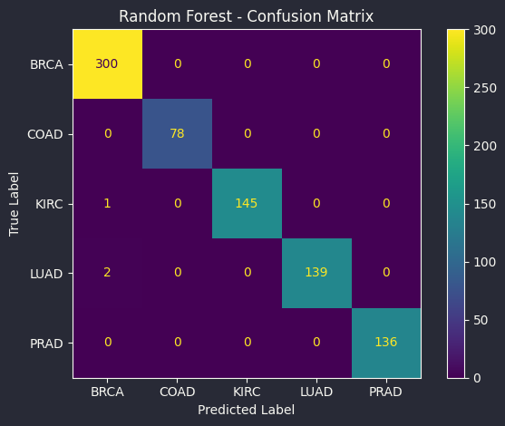
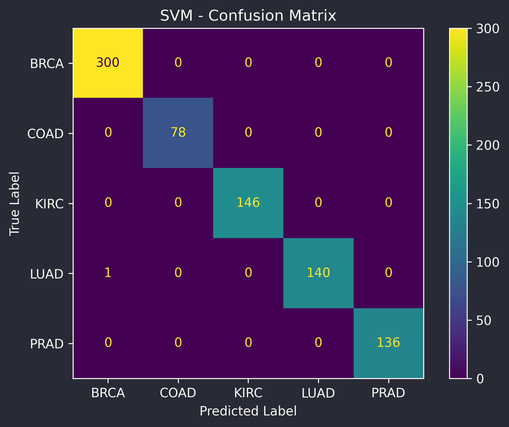

# 🧬 Cancer Classification from RNA-Seq Gene Expression 


---

## 📌 Overview

This project explores how machine learning can classify different cancer types 
using high-dimensional RNA-Seq gene expression data (~20,000 features per sample).

It focuses on understanding how feature selection and dimensionality reduction 
impact model performance in complex biological datasets.

---

## 📂 Dataset

📂 **Dataset:** UCI Gene Expression Cancer RNA-Seq Dataset  

The dataset is too large to store in the repository.

🔗 Download here:  
https://archive.ics.uci.edu/dataset/401/gene+expression+cancer+rna+seq  

After downloading, place it in:

dataset/raw/

---

## 🎯 Objectives

- Classify cancer types based on gene expression  
- Compare performance of multiple ML models  
- Perform feature selection to identify important genes  
- Build a clean, scalable ML pipeline  

---

## 🚀 Features

- ✅ Random Forest & Support Vector Machine (SVM)  
- ✅ Cross-validation for robust evaluation  
- ✅ Feature importance analysis  
- ✅ Feature selection (SelectKBest + VarianceThreshold)  
- ✅ Near-perfect classification performance (~99.8% with SVM)  
- ✅ Industry-style modular project structure  

---

## 🧠 Models Used

### 🌲 Random Forest
- Ensemble learning method  
- Handles high-dimensional data effectively  
- Provides feature importance  

### 📈 Support Vector Machine (SVM)
- Effective in high-dimensional spaces  
- Linear kernel used for classification  
- Requires feature scaling  

---

## 📊 Results

| Model          | Accuracy | Precision | Recall | F1 Score |
|---------------|----------|----------|--------|----------|
| Random Forest | 0.9963   | 0.9964   | 0.9963 | 0.9963   |
| SVM           | 0.9988   | 0.9988   | 0.9988 | 0.9988   |

- Strong performance across all cancer types  
- Minimal misclassification  
- Validated using 5-fold cross-validation  

---

## 📊 Visualizations

### 📌 PCA Visualization (Cluster Formation)

<p align="center">
  
</p>

---

### 📉 Feature Selection vs Accuracy

<p align="center">
  
</p>

---

### 📊 Class Distribution

<p align="center">
  
</p>

---

### 📊 Random Forest Confusion Matrix

<p align="center">
  
</p>

---

### 📊 SVM Confusion Matrix

<p align="center">
  
</p>

---

## 🔍 Interpretation

- High accuracy even with fewer genes → strong signal in data  
- PCA shows clear cluster separation  
- Feature selection reduces dimensionality without loss  
- Models generalize well across all classes  
- Class imbalance has minimal effect  

---

## 📁 Project Structure

```
project/
│
├── models/
│   ├── rf_model.pkl
│   ├── svm_model.pkl
│   └── scaler.pkl
│
├── notebooks/
│   └── exploratory_analysis.ipynb
│
├── results/
│   ├── rf_results.txt
│   ├── svm_results.txt
│   ├── rf_confusion_matrix.png
│   ├── svm_confusion_matrix.png
│   ├── feature_vs_accuracy.png
│   ├── Class_Distribution.png
│   └── Cluster_Formation_of_Classes.png
│
├── src/
│   ├── __init__.py
│   ├── data_loader.py
│   ├── model.py
│   ├── train.py
│   ├── evaluate.py
│   └── feature_selection.py
│
├── .gitignore
├── README.md
└── requirements.txt
```

---

## ⚙️ Installation

```bash
pip install -r requirements.txt
```

---

## ▶️ Usage

### Train Models
```bash
python -m src.train
```

### Evaluate Models
```bash
python -m src.evaluate
```

### Feature Selection
```bash
python -m src.feature_selection
```

---

## 📂 Outputs

- 📄 Evaluation reports  
- 📊 Confusion matrices  
- 📉 Feature selection plots  

---

## 🔍 Key Learnings

- Feature selection is critical for high-dimensional data  
- PCA reveals hidden structure  
- Simple models can perform extremely well  
- Cross-validation improves reliability  
- Clean structure improves scalability  

---

## 🚀 Future Improvements

- Add XGBoost / LightGBM  
- Use SHAP for explainability  
- Hyperparameter tuning  
- Deploy using FastAPI  
- Use larger datasets (TCGA)  

---

## 👨‍💻 Author

**Deepak**

---

## ⭐ Acknowledgements

- UCI Machine Learning Repository  
- scikit-learn documentation  
